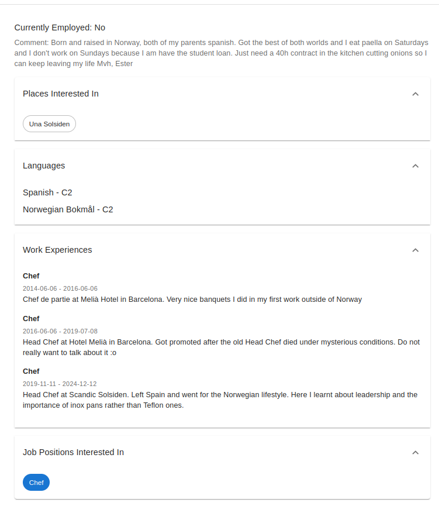
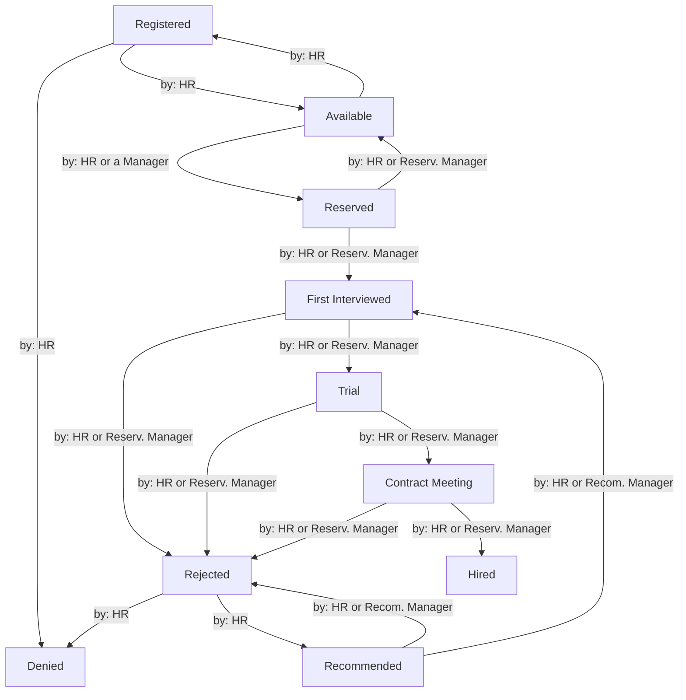
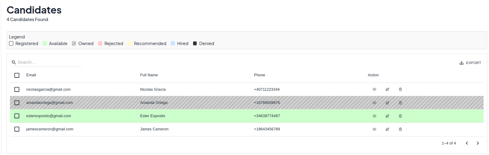
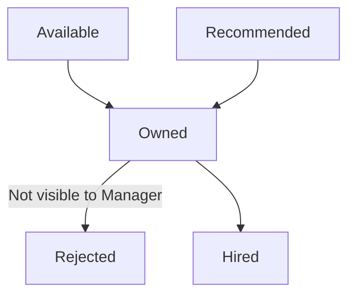
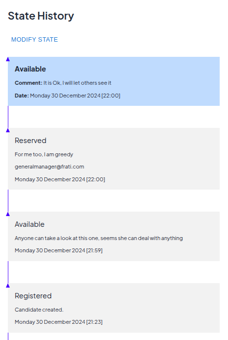
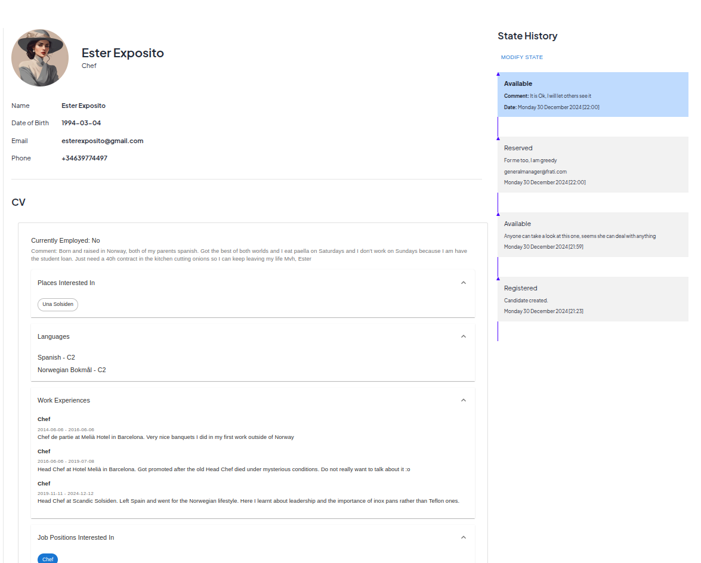
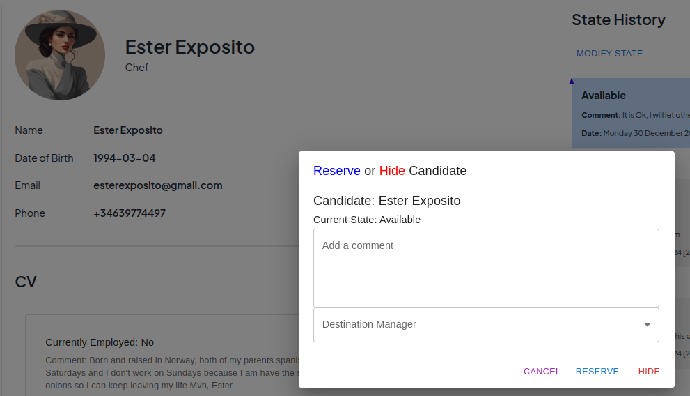
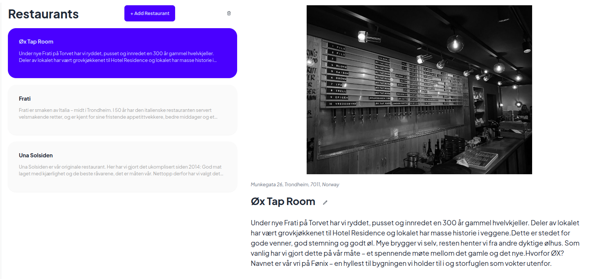
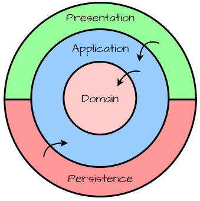

# CV Manager App

Welcome to the **CV Manager App** – a powerful, production-ready, and cleanly architected .NET application that demonstrates robust design principles and modern best practices. This project is a testament to the commitment to building scalable, maintainable, and secure software solutions. It’s not just about managing CVs; it’s about delivering a platform that is easy to extend, easy to maintain, and provides a good using interface. 

## Purpose

The main objective of this project is creating a production-ready API backend with the use of the dotnet framework. Along the way, the development is carried out using Domain Driven Design (DDD) principles together with Clean Architecture (CA) principles. 

The frontend tool is more of an "example" of how the backend could be used but serves as a simple but powerful tool to exemplify the use cases to users that are not familiarized with API clients.

If your interest is mainly on this specific tool, jump to the [Domain Specifics](#domain-specifics) section.

---

## Table of Contents

1. [Overview](#overview)  
2. [Key Features](#key-features)  
3. [Domain Specifics](#domain-specifics)
   - [Candidates](#candidates)
   - [CVs](#cvs)
   - [Candidate States](#candidate-states)
   - [Restaurants](#restaurants)
   - [Users](#users)

3. [Architecture](#architecture)  
   - [Request Flow](#request-flow)
   - [Command Flow](#command-flow)
   - [Event Flow](#event-flow)

---

## Overview

The **CV Manager App** is designed to help organizations streamline the process of collecting, storing, and retrieving Curricula Vitae (CVs) from job applicants. Beyond its core functionality of maintaining candidate profiles and resumes, the application demonstrates how a modern .NET solution can be built with:

- **Domain Driven Design** to develop the core logic of the system.
- **Clean Architecture Principles** ensuring maintainable and testable code.
- **Eventual Consistency** for resilient, distributed operations.
- **Cross-Cutting Concerns** that handle logging, auditing, and security in a unified and consistent manner.

It is written by a dedicated .NET developer with a passion for clean coding standards, a knack for designing foolproof architectures, and hands-on experience in delivering production-grade solutions.

All business rules are imposed in the backend, but the following frontend has implemented some of them for easier usage and integration.

---

## Key Features

1. **CV Management**  
   - Create, read, and delete Candidates and their respective CVs and associated information.
   - Manage the businesses (restaurants in our case) applicants can express interest in.
   - Create a flow for the candidate state where its visibility to different users is conditional (more on [Candidate States](#candidate-states))

2. **Role, Permission, Policy-Based Security**  
   - Fine-grained role and permission management ensuring secure and authorized access to data.
   - Using dotnet's identity service and its role / user claims, and extending it for for properties

3. **Eventual Consistency**  
   - Ensures data consistency across various subsystems without sacrificing performance or scalability.
   - All operations performed by each API call are treated as an "all or nothing", preventing undesired changes if the action presents some errors.

4. **Extensive Logging and Auditing**  
   - Request, command, and database logging for full traceability.
   - Audit trails that allow you to track changes over time.

5. **Transaction Management**  
   - Built-in transaction context to handle complex operations gracefully.
   - Allows commands to be built in of multiple commands and adds checkpoints on transaction saving in order to avoid repeating operations or having to perform full rollbacks or restarts.

## Domain Specifics

In this part, we focus on the specific application at hand.
For this case specific, we deal with job positions and businesses specific to the hospitality world.

### Candidates

Main entity of the app representing the basic information of a candidate. That is, contact information, name, date of birth, etc.


### CVs

This entity is linked to a candidate and contains all the information of a candidate's work experiences, languages, and places he is interested in working (a selection of the provided businesses, in our case entity Restaurant). As candidates apply to restaurants in this case scenario, Manager roles include those of **General Manager**, **Restaurant Manager** and **Head Chef** and each will only have visbility to a certain type of employees. For example Head Chef cannot see Waiters, Restaurant Manager cannot see Chefs and General Manager can see all.



### Candidate States

Contains specific information on the Candidate's current state and visibility, and allows for a candidate to be hidden, reserved, recommended, etc. Its flow is:



As it can bee seen, HR can execute any transition, and transitions in between owned states (that is, Reserved, First Interviewed, Trial, Hired). The reserving manager only can only process its own owned applicants but has no access to Rejected applicants, as Rejected applicants must be reintroduced to the system by the HR.

In his UI, the candidates will appear with the following Legend color:


In practice, a manager tracks a candidate's state in the following reduced graph:



The current state and past states of a candidate can be seen for reference:




And finally, the final view is obtained from a candidate:


The "Modify State" button opens the modal to change the candidate's state:



In this case, this one is HR specific because it needs to choose a destination manager. For a manager, the dialog will only have a "Comment" text area.

### Restaurants

For this case specific, we deal with job positions and businesses specific to the hospitality world. Therefore, this view will only show Restaurant businesses that the HR has added.



### Users

The information on a single user is limited for now as it is intended that the HR provides the accounts to the respective actors. So only contact information and Roles are provided:


---

## Architecture



The **CV Manager App** embraces Clean Architecture (often referred to as Onion Architecture or Hexagonal Architecture variants). This ensures:

1. **Independence of Frameworks**: The core domain logic does not rely on external frameworks, improving testability and flexibility.
2. **Testable Components**: At every layer, components are easy to unit test and maintain.
3. **Maintainable and Extensible**: New features or modifications can be introduced without causing a ripple effect across the entire system.

When put into practice, this translates in:

- **Api** project handling the routing and the provided endpoints.
- **Contracts** class lib specifying the inputs and outputs of the API for easier usage.
- **Application** layer executing business transactions of users and managing the use cases and their requirements.
- **Domain** project containing the key information on the specific domain at hand, so no other layer needs to know specific business rules.
- **Infrastructure** layer handling the services (such as DB, image provider, etc) that the application requires


### Request Flow

All requests interact with the application in the following way:

1. Request is sent to one of the specified endpoints using its respective contract
2. A Middleware encapsulates the whole request executing providing it with a transaction context
3. The execution of a request can trigger events that also execute (more on: [Command Flow](#Command-Flow))
4. After the request's response, some data is collected on its outcome for future audits. This includes multiple entities that can be gruped by Transaction Id or Trace Id to get the full picture of the execution (only visible to user admin for debugging)


### Command Flow

A request triggers a specific Query or Command (using CQRS) which can:

1. Trigger multiple Queries or Commands that perfrom complicated tasks
2. Access the ITransactionContext to allow multi-step executions with local save points and rollbacks:
```csharp
public interface ITransactionContext
{
    IDbContextTransaction? GetCurrentTransaction();
}

public interface IDbContextTransaction : IDisposable, IAsyncDisposable
{
    Guid TransactionId { get; }
    Task CreateSavepointAsync(string name, CancellationToken cancellationToken = default); 
    Task RollbackToSavepointAsync(string name, CancellationToken cancellationToken = default);
}
```
3. Plan out the execution of future events to achieve consistency without delaying the users's response. This achieves fast response time without compromising the system's integrity

Furthermore, every Command, including the forementioned nested commands, undergoes the following pipeline:

```csharp
services.AddMediatR(options => 
        {
            options.AddOpenBehavior(typeof(AuthorizationBehavior<,>));
            options.AddOpenBehavior(typeof(ValidationBehaviour<,>));
            options.AddOpenBehavior(typeof(CommandAuditBehavior<,>));
        });
```

These behaviours are interface specific, so only commands that implement the correct interfaces will trigger the full pipeline. In that way, we can avoid unwanted behaviours for some queries. The bahaviours are:

1. **Authorization Behaviour** combining Role-based, Permission based or Policy-based accesses for a tailored approach to each action. Each command specifies its Authorization Requirements using the following attribute:

```csharp
[AttributeUsage(AttributeTargets.Class, AllowMultiple = true)]
public class AuthorizeAttribute : Attribute
{
    public string? Permissions { get; set; }
    public string? Roles { get; set; }
    public string? Policies { get; set; }
}
```

It makes use of a "Current User" provider and evaluates both 3 strategies against the User's claims:

```csharp
public interface IAuthorizationService
{
    Task<ErrorOr<Success>> AuthorizeCurrentUser<T>(
        IAuthorizeableRequest<T> request,
        List<string> requiredRoles,
        List<string> requiredPermissions,
        List<string> requiredPolicies);
}
```

Permissions are divided in different scopes. For example, there would be "Application:User:Create" or "Administration:User:Create" for creating users with certain privileges. This allows to further fine-grain the possible actors of a request.

2. **Validation Behaviour** using the "FluentValidation" library to perform checks on a command (not domain specific) before it reaches its handler.

3. **Command Audit** which registers the command as an entity that can later be consulted by the system administrator or certain roles.


### Event Flow

Any command can raise an event that implements the "INotification" class of "MediatR" and will be handled at the end of the command's execution. This process can be nested, in the sense that, during the execution of an event, another event can be raised.

The main purpose of this approach is again the mantainability of the platform and the cohesion of a request, as if different requests can end up performing the same action, it is better to delegate said execution to a handler. In this way, the actions a command triggers can be modified and its logic can be modularized further.

As these events are executed in the same transaction, if one of them fails due to validation reasons, a full rollback can be achieved and the error can be registered (could also be pushed to the user in the future implementing notifications).

--- 

